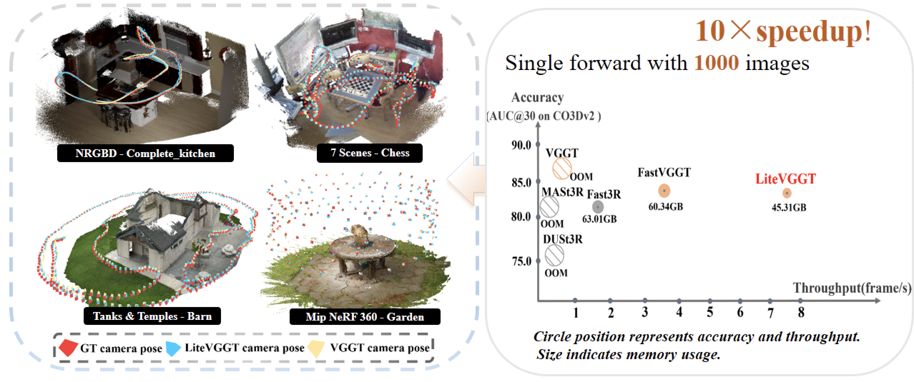

<div align="center">
  <h1>LiteVGGT: Boosting Vanilla VGGT via Geometry-aware Cached Token Merging</h1>

  <a href="http://arxiv.org/abs/2512.04939"></a>
<a href="https://garlicba.github.io/LiteVGGT/"></a>

**[Zhijian Shu](#), [Cheng Lin](https://clinplayer.github.io/), [Tao Xie](https://github.com/xbillowy), [Wei Yin](https://yvanyin.xyz/), [Ben Li](https://github.com/fanerlight), [Zhiyuan Pu](https://openreview.net/profile?id=~Zhiyuan_Pu1),**  
**[Weize Li](https://ericlee0224.github.io/), [Yao Yao](https://yoyo000.github.io/), [Xun Cao](https://cite.nju.edu.cn/People/Faculty/20190621/i5054.html), [Xiaoyang Guo](https://xy-guo.github.io/), [Xiao-Xiao Long](https://www.xxlong.site/)**


Nanjing University of Posts and Telecommunications, Horizon Robotics, Nanjing University,  
Zhejiang University, Macau University of Science and Technology,
TARS Robotics,  
China Mobile Zijin Innovation Institute

</div>


##  Overview

For 1000 input images, LiteVGGT achieves a **10× speedup** over VGGT while maintaining high accuracy in camera pose and point cloud prediction. Its scalability and robustness make large-scale scene reconstruction more efficient and reliable.



## Environment Setup
First, create a virtual environment using Conda, clone this repository to your local machine, and install the required dependencies.

```bash
conda create -n litevggt python=3.10
conda activate litevggt
git clone git@github.com:GarlicBa/LiteVGGT-repo.git
cd LiteVGGT-repo
pip install -r requirements.txt
```

Install the Transformer Engine package following its official installation requirements (see https://github.com/NVIDIA/TransformerEngine):

```bash
export CC=your/gcc/path
export CXX=your/g++/path
pip install --no-build-isolation transformer_engine[pytorch]
```

Then, download our LiteVGGT checkpoint that has been **finetuned** and **TE-remapped**:
```bash
wget https://huggingface.co/ZhijianShu/LiteVGGT/resolve/main/te_dict.pt
```

## Inference
```bash
python run_demo.py \
  --ckpt_path path/to/your/te_dict.pt \
  --img_dir path/to/your/img_dir \
  --output_dir ./recon_result \
```

## Evaluation

### ScanNet
Evaluate LiteVGGT on the ScanNet dataset with 1,000 input images.
```bash
python eval/eval_scannet.py \
--ckpt_path your/path/te_dict.pt \
--data_dir your/path/scannetv2/processed_data \
--gt_ply_dir your/path/scannetv2/raw/scans \
--output_path ./eval_results \
--num_scenes 50 \
--input_frame 1000 \
```

### 7 Scenes & NRGBD
Evaluate across two datasets, sampling keyframes every 3 frames:
```bash
python eval/eval_7andN.py \
--ckpt_path your/path/te_dict.pt \
--output_dir ./eval_results \
--kf 3 \
```

### Co3D
Follow VGGT's [protocol](https://github.com/facebookresearch/vggt/tree/evaluation/evaluation) to prepare the Co3D dataset.

```bash
python eval/co3d/test_co3d.py \
--model_path your/path/te_dict.pt \
--co3d_dir your/path/co3dv2 \
--co3d_anno_dir your/path/anno \
--seed 0 \
```

### DTU dataset
```bash
python eval/eval_DTU.py \
--model_path your/path/te_dict.pt \
--dtu_dir your/path/eval_data/dtu \
--seed 0 \
```


## Checklist
- [x] Release the model weights
- [x] Release the evaluation code

## Acknowledgements

Thanks to these great repositories: [VGGT](https://github.com/facebookresearch/vggt),[FastVGGT](https://github.com/mystorm16/FastVGGT) [Dust3r](https://github.com/naver/dust3r),  [Fast3R](https://github.com/facebookresearch/fast3r), [CUT3R](https://github.com/CUT3R/CUT3R), [StreamVGGT](https://github.com/wzzheng/StreamVGGT), [ToMeSD](https://github.com/dbolya/tomesd) and many other inspiring works in the community.


<!-- ## Citation

If you find this project helpful, citing our paper would be greatly appreciated:
```bibtex
@inproceedings{wang2025vggt,
  title={VGGT: Visual Geometry Grounded Transformer},
  author={Wang, Jianyuan and Chen, Minghao and Karaev, Nikita and Vedaldi, Andrea and Rupprecht, Christian and Novotny, David},
  booktitle={Proceedings of the IEEE/CVF Conference on Computer Vision and Pattern Recognition},
  year={2025}
}
``` -->